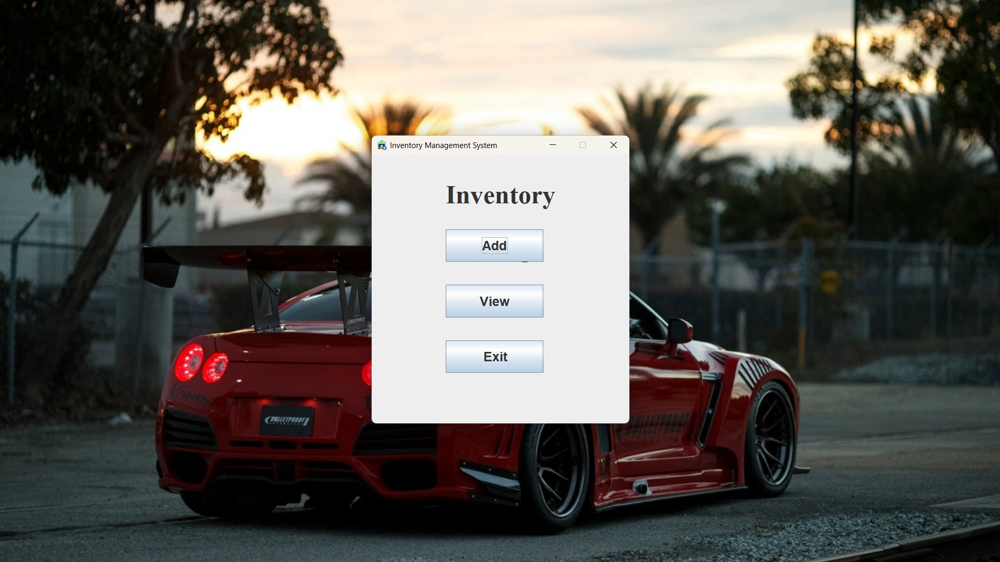
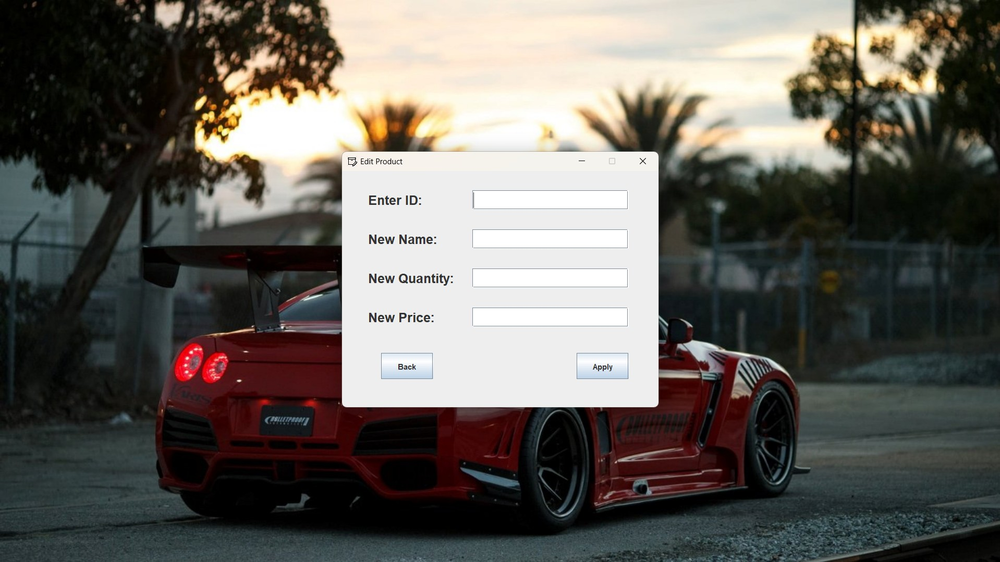
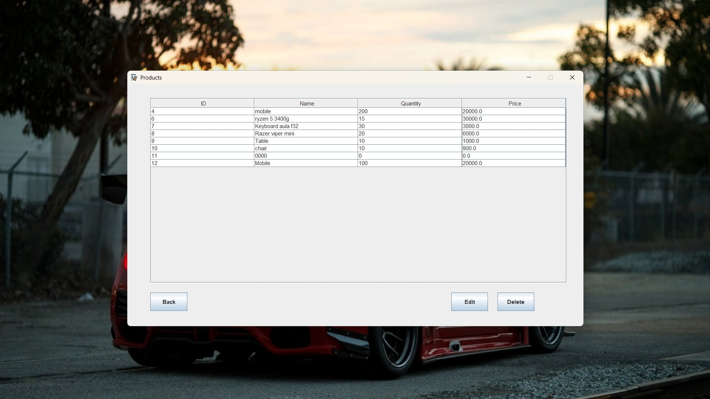

# Inventory Management System

A simple inventory management app built with Java, JDBC and MySQL. Provides CRUD for products, categories, and stock management with a basic UI.

## Features
- Create / Read / Update / Delete (Products)
- MySQL database using JDBC
- Simple UI using Swing

## Tech Stack
- Java 11+
- MySQL 8
- JDBC
- UI: Swing
- Build: Maven / Gradle

## Screenshots
### Home

### Add Product

### Delete Product

### Edit Product

### View Products

## License
This project is licensed under the MIT License - see the [LICENSE](LICENSE) file for details.

## Contact
Remon Molla — remonmolla101@gmail.com
